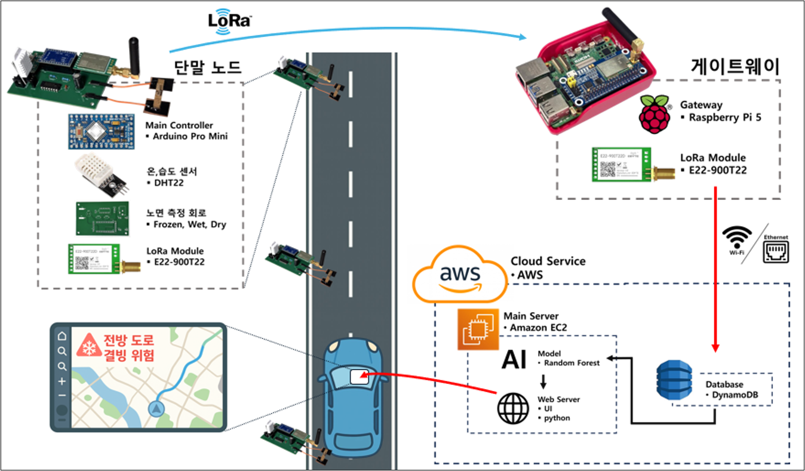

# 저가·저전력 도로 결빙 감지 경보 시스템

> 성결대학교 전공종합설계 — IoT 센서 네트워크를 활용한 실시간 도로 결빙 감지 및 시각화 시스템

---

## 목차

1. [프로젝트 개요](#1-프로젝트-개요)
2. [시스템 아키텍처](#2-시스템-아키텍처)
3. [데이터 흐름](#3-데이터-흐름)
4. [주요 기능](#4-주요-기능)
5. [구성 요소](#5-구성-요소)
6. [노면 판단 알고리즘](#6-노면-판단-알고리즘)
7. [파일 구조](#7-파일-구조)
8. [Task 매핑](#8-task-매핑)
9. [환경변수 설정](#9-환경변수-설정)
10. [실행 방법](#10-실행-방법)
11. [기술 스택](#11-기술-스택)
12. [보안 주의사항](#12-보안-주의사항)
13. [향후 개발 계획](#13-향후-개발-계획)

---

## 1. 프로젝트 개요

겨울철 도로에서 눈에 보이지 않는 블랙아이스(결빙)는 교통사고의 주요 원인입니다.  
기존 고가의 결빙 감지 시스템은 설치·유지보수 비용이 높아 외곽 도로나 생활 도로에 보급하기 어렵다는 한계가 있습니다.

본 시스템은 **저가 IoT 센서 노드**와 **LoRa 무선 통신**을 활용해 도로 결빙 위험을 실시간으로 감지하고, **웹 대시보드**로 시각화하는 경량 시스템입니다.

**핵심 목표**
- Arduino 기반 저가·저전력 센서 노드로 전도도·온도·습도 측정
- LoRa 통신으로 원거리 저전력 데이터 전송
- AWS 클라우드(API Gateway → Lambda → DynamoDB) 연동
- Random Forest AI 모델로 노면 상태 자동 판단
- Leaflet.js 기반 지도 대시보드로 결빙 위험 시각화

---

## 2. 시스템 아키텍처



---

## 3. 데이터 흐름

```
단말 노드 (Arduino Pro Mini)
    ↓  LoRa 무선 전송 (9바이트 바이너리 패킷)
Raspberry Pi 5 게이트웨이
    ↓  HTTP POST
AWS API Gateway → Lambda → DynamoDB
    ↓  HTTP GET (5초 캐시)
EC2 Python 웹 서버
    ↓
Random Forest AI 모델 추론
    ↓
Leaflet 지도 대시보드 (브라우저)
```

---

## 4. 주요 기능

| 기능 | 설명 |
|------|------|
| **센서 데이터 수신** | AWS DynamoDB에서 최신 센싱 데이터 조회 (5초 캐시) |
| **AI 노면 판단** | Random Forest 모델로 노면 상태 자동 분류 + 위험도 점수 산출 |
| **웹 지도 시각화** | Leaflet.js 지도에 센서 노드 위치·상태 마커 실시간 표시 |
| **노드 상세 조회** | 개별 노드 클릭 시 온도·습도·전도도·AI 판단 이유 확인 |
| **최근 데이터 목록** | 우측 패널에 최신 센싱 데이터 목록 표시 |
| **저전력 단말** | Sleep mode + 랜덤 백오프로 배터리 절약 및 패킷 충돌 방지 |
| **LoRa 게이트웨이** | Raspberry Pi가 LoRa 패킷 수신 후 바이너리 디코딩 및 AWS 전송 |

---

## 5. 구성 요소

### 단말 노드 — `hardware/FinalNodeCode/`
- **MCU**: Arduino Pro Mini
- **센서**: DHT22 (온도·습도), 노면 측정 회로 (전도도 → 주파수 변환)
- **통신**: LoRa E22-900T22 (SoftwareSerial, 9600 bps)
- **절전**: 15분 주기 Sleep mode (`LowPower.h`)
- **전원**: 18650 리튬이온 배터리 2구
- **충돌 방지**: 다중 노드 랜덤 백오프(Jitter) 적용
- **패킷 구조**: 9바이트 바이너리 (`node_id 1B + freq 4B + temp 2B + hum 2B`)

### LoRa 게이트웨이 — `hardware/Gateway_260417.py`
- **하드웨어**: Raspberry Pi 5 + LoRa E22-900T22 HAT
- **기능**: LoRa 패킷 수신 → 바이너리 디코딩 (`struct.unpack`) → AWS API Gateway로 전송

### 클라우드 — `hardware/Lambda.js`
- **API Gateway**: HTTP GET(조회) / POST(저장) 처리
- **Lambda**: Node.js 기반 수신·저장 로직
- **DynamoDB**: 센서 데이터 저장소 (`BlackIceData_SenSing`)

### AI 모델 — `app/inference.py`
- **알고리즘**: Random Forest (`scikit-learn`)
- **입력**: 측정 시간(hour), 온도(°C), 습도(%), 전도도(Hz)
- **출력**: 노면 상태 (안전 / 빗길 주의 / 결빙 위험) + 위험도 점수 (0~100)

### 웹 서버 — `app/`, `static/`, `integrated_app.py`
- **백엔드**: Python 표준 라이브러리 (`http.server`)
- **프론트엔드**: HTML / CSS / JavaScript (Leaflet 지도)
- **실행**: `integrated_app.py` 단일 명령으로 전체 서버 구동

---

## 6. 노면 판단 알고리즘

센서에서 측정한 **전도도(conductivity, Hz)** 값이 핵심 입력입니다.  
노면에 수분·결빙이 발생하면 전기 전도도가 변화하고, 이를 주파수로 변환하여 측정합니다.

| 전도도 범위 | 노면 상태 | 위험도 점수 | 마커 색상 |
|------------|---------|-----------|---------|
| 0 ~ 100 Hz | Wet (수분 있음) | 60점 | 주황색 (주의) |
| 101 ~ 850 Hz | Frozen (결빙) | 95점 | 빨간색 (위험 ⚠) |
| 851 ~ 1000 Hz | Dry (건조) | 10점 | 초록색 (안전) |

AI 모델(Random Forest)은 전도도 외에 **측정 시간, 온도, 습도**를 함께 고려하여 최종 노면 상태를 판단합니다.  
현재 더미 데이터로 학습된 상태이며, 실측 데이터 확보 후 재학습 예정입니다.

---

## 7. 파일 구조

```
전종설_Python/
├── integrated_app.py               # 통합 서버 실행 진입점
├── requirements.txt
├── .gitignore
├── app/
│   ├── config.py                   # 서버 설정 (환경변수로 관리)
│   ├── web.py                      # HTTP 요청 핸들러
│   ├── inference.py                # AI 모델 추론
│   ├── db.py                       # SQLite 연동
│   ├── models.py                   # 데이터 모델
│   ├── map_seed.py                 # 센서 노드 위치 정보
│   ├── bootstrap.py                # DB 초기화
│   └── conductivity_prediction_model.pkl
├── static/
│   ├── index.html
│   ├── app.js
│   └── style.css
├── docs/
│   ├── architecture.png            # 시스템 아키텍처 다이어그램
│   ├── chamber_test.jpg            # 결빙 시뮬레이션 챔버 실험 사진
│   └── personal_work_summary.md
└── hardware/                       # 하드웨어 관련 코드
    ├── FinalNodeCode/
    │   └── FinalNodeCode.ino       # Arduino 센서 노드
    ├── Gateway_260417.py           # Raspberry Pi 게이트웨이
    └── Lambda.js                   # AWS Lambda 함수
```

---

## 8. Task 매핑

| Task | 내용 | 관련 파일 |
|------|------|-----------|
| 1 | 센서 측정 및 LoRa 전송 | `hardware/FinalNodeCode/FinalNodeCode.ino` |
| 2 | LoRa 패킷 수신 및 AWS 전송 | `hardware/Gateway_260417.py` |
| 3 | AWS 데이터 수신·저장 | `hardware/Lambda.js` → DynamoDB |
| 4 | 센서 데이터 조회 및 AI 추론 | `app/web.py`, `app/inference.py` |
| 5 | 웹 지도 시각화 | `static/app.js`, `static/index.html` |
| 6 | 노드 위치 정의 | `app/map_seed.py` |
| 7 | 통합 서버 실행 | `integrated_app.py` |

---

## 9. 환경변수 설정


```env
BLACKICE_AWS_API_URL=https://<your-api-id>.execute-api.ap-northeast-2.amazonaws.com/default/blackIceReciver
BLACKICE_AWS_API_KEY=<your-api-key>
BLACKICE_HOST=0.0.0.0
BLACKICE_PORT=8000
BLACKICE_SCHOOL_NAME=성결대학교
BLACKICE_SCHOOL_LAT=37.3802
BLACKICE_SCHOOL_LON=126.9281
```

| 환경변수 | 기본값 | 설명 |
|----------|--------|------|
| `BLACKICE_AWS_API_URL` | *(필수)* | AWS API Gateway URL |
| `BLACKICE_AWS_API_KEY` | *(필수)* | AWS API Key |
| `BLACKICE_HOST` | `0.0.0.0` | 서버 호스트 |
| `BLACKICE_PORT` | `8000` | 통합/웹 서버 포트 |
| `BLACKICE_SCHOOL_NAME` | `성결대학교` | 지도 중심 학교명 |
| `BLACKICE_SCHOOL_LAT` | `37.3802` | 학교 위도 |
| `BLACKICE_SCHOOL_LON` | `126.9281` | 학교 경도 |

---

## 10. 실행 방법

### 1. 의존성 설치

```bash
python -m venv venv
venv\Scripts\activate        # Windows
# source venv/bin/activate   # Linux / Mac
pip install -r requirements.txt
```

### 2. 서버 실행

```bash
python integrated_app.py
```

브라우저에서 `http://localhost:8000` 으로 접속합니다.

---

## 11. 기술 스택

| 영역 | 기술 |
|------|------|
| 단말 | Arduino, C++, DHT22, LoRa E22-900T22 |
| 게이트웨이 | Raspberry Pi 5, Python, RPi.GPIO, pyserial |
| 클라우드 | AWS API Gateway, Lambda (Node.js), DynamoDB, EC2 |
| 백엔드 | Python, `http.server`, SQLite |
| AI | scikit-learn (Random Forest), pandas, joblib |
| 프론트엔드 | HTML, CSS, JavaScript, Leaflet.js |
| 인프라 | Ubuntu, SSH |

---

## 12. 보안 주의사항

이 저장소에는 다음 정보가 포함되지 않습니다.

- AWS API URL / API Key
- AWS Access Key / Secret Key
- EC2 서버 IP / DNS
- SSH 키 파일 (`.pem`)
- `.env` 파일
- DB 파일 (`data/blackice.db`)

민감 정보는 환경변수로 관리하며, `.gitignore`로 추적을 제외했습니다.

---

## 13. 향후 개발 계획

- [ ] 실측 데이터 기반 AI 모델 재학습 및 정확도 평가
- [ ] 겨울철 다중 지역 단말 모듈 설치시의 문제점 확인
- [ ] 다양한 환경에서 모듈 작동 테스트(해당 프로젝트를 사계절로 확장하여 사용한다 했을때 사계절에서 모두 작동 가능한지 확인)
