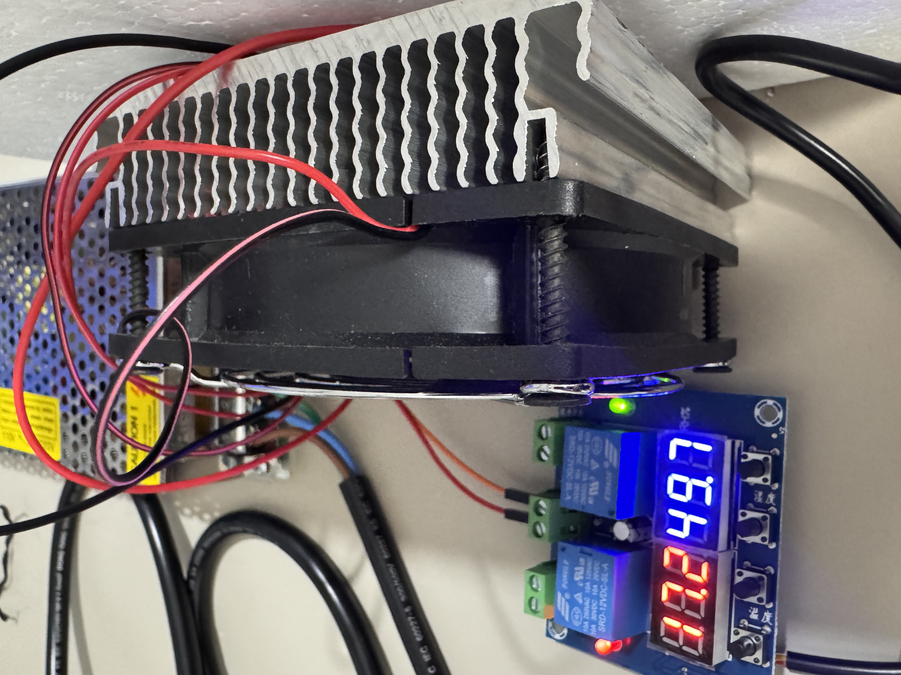

# 개인 담당 작업 — 박경준

전공종합설계 프로젝트 / 2026년 1학기 / 성결대학교

---

## 담당 역할

**프론트엔드 / 백엔드 / 통합 및 배포**

전체 시스템에서 사용자에게 결빙 정보를 보여주는 웹 서버와 대시보드 UI를 구현하고, 하드웨어·클라우드·AI 모델을 하나로 묶는 통합 작업을 담당했다.

---

## 1. 프론트엔드 / UI

웹 화면은 지도 기반 대시보드 형태로 구성했다. 센서 노드의 위치를 지도에 표시하고, 노면 상태와 결빙 위험도를 실시간으로 확인할 수 있도록 했다.

**진행 내용**

- Figma 기반 와이어프레임 설계
- HTML / CSS / JavaScript 개발 환경 구축
- Leaflet 지도 연동 및 노드 마커 렌더링
- Polyline을 활용한 구간별 경로 표시
- 구간 데이터에 따른 경로 색상 변경 (안전 / 주의 / 위험)
- 결빙 위험 감지 시 Alert 화면 구현
- 우측 패널 최근 센싱 데이터 목록 표시
- 반응형 레이아웃 및 UI 컴포넌트 스타일 정리

---

## 2. 백엔드 / 서버

Python 표준 라이브러리 기반의 HTTP 서버를 구현했다. AWS DynamoDB에서 센서 데이터를 가져와 AI 모델에 입력하고, 판단 결과를 프론트엔드로 응답하는 흐름을 담당했다.

**진행 내용**

- Python `http.server` 기반 HTTP 요청 핸들러 구현 (`app/web.py`)
- AWS API Gateway → Lambda → DynamoDB 데이터 조회 연동
- 노드별 최신 데이터 추출 및 시간 파싱 로직 구현
- AI 모델 추론 결과를 API 응답으로 직렬화
- SQLite 기반 데이터 저장 구조 설계 (`app/db.py`)
- 센서 데이터 모델 정의 (`app/models.py`)
- 서버 설정 환경변수 분리 (`app/config.py`)
- 게이트웨이·서버·웹을 단일 프로세스로 통합 (`integrated_app.py`)

---

## 3. 통합 및 배포

하드웨어(아두이노·라즈베리파이)와 클라우드(AWS), AI 모델, 웹 서버를 하나의 흐름으로 연결하는 통합 작업을 맡았다.

**진행 내용**

- AWS EC2 (Ubuntu) 인스턴스 생성 및 SSH 접속 확인
- 로컬 개발 환경의 웹 서버를 EC2로 이전
- Python 가상환경 구성 및 의존성 패키지 설치 (`requirements.txt`)
- 학습된 Random Forest 모델 파일을 프로젝트에 적용 (`conductivity_prediction_model.pkl`)
- `integrated_app.py` 단일 명령으로 전체 서버 실행 가능하도록 구성
- API 키 등 민감 정보를 환경변수 방식으로 변경하여 GitHub 공개 대응

---

## 4. 결빙 시뮬레이션 챔버 실험 (개인 진행)

센서 노드의 결빙 감지 성능을 실험실 환경에서 검증하기 위해, 영하 환경을 인위적으로 만드는 냉각 챔버를 개인적으로 제작·실험했다.



### 구성

| 구성 요소 | 내용 |
|----------|------|
| 냉각 소자 | 펠티어 소자 (TEC, 열전 냉각 방식) |
| 방열 | 알루미늄 히트싱크 + 원심 블로어 팬 |
| 전원 | 12V DC 스위칭 파워 서플라이 |
| 온도 제어 | 릴레이 모듈 + 듀얼 디지털 온도 컨트롤러 |
| 표시 | 빨간 디스플레이(현재 온도) / 파란 디스플레이(설정 온도) |

### 목적

센서 노드가 실제 결빙 상황에서 올바른 전도도 값을 출력하는지 확인하기 위해, 테스트 환경의 온도를 영하로 낮추는 것을 목표로 했다.

### 실험 결과 및 문제점

챔버 온도가 영하로 내려가지 않았다. 원인으로 다음 두 가지를 검토했다.

1. **단열 문제**: 챔버 외벽을 통한 열 유입이 펠티어 소자의 냉각 능력을 초과했을 가능성
2. **펠티어 소자 성능 과소평가**: 사용한 펠티어 소자의 냉각 용량(W)이 목표 온도 도달에 부족했을 가능성

실험 당시 온도 컨트롤러 수치는 약 33°C (현재) / 49°C (열원 측)로, 냉각 면보다 방열 면의 온도가 더 높은 정상 동작은 확인됐으나 영하 도달에는 실패했다.

### 결론

펠티어 방식의 소형 냉각 챔버로 영하 환경을 만드는 것은 충분한 단열재 적용과 고출력 펠티어 소자 또는 다단 스택 구성이 필요하다고 판단했다. 이 실험은 프로젝트 본 일정과 별개로 개인적으로 진행한 내용이다.

---

## 시스템 흐름 (전체)

```
단말 노드 (Arduino)
    ↓ LoRa 무선 전송
Raspberry Pi 게이트웨이
    ↓ HTTP POST
AWS API Gateway → Lambda → DynamoDB
    ↓ HTTP GET (5초 캐시)
EC2 Python 웹 서버
    ↓
Random Forest AI 모델 추론
    ↓
Leaflet 지도 대시보드 (브라우저)
```

---

## 사용 기술

| 영역 | 기술 |
|------|------|
| 프론트엔드 | HTML, CSS, JavaScript, Leaflet |
| 백엔드 | Python, `http.server`, SQLite |
| AI | scikit-learn (RandomForest), pandas, joblib |
| 클라우드 | AWS EC2, API Gateway, Lambda, DynamoDB |
| 인프라 | Ubuntu, SSH, Python 가상환경 |

---

## 보안 처리

GitHub 공개 전 다음 항목을 환경변수 또는 `.gitignore` 처리했다.

- AWS API URL / API Key → 환경변수 (`BLACKICE_AWS_API_URL`, `BLACKICE_AWS_API_KEY`)
- EC2 서버 IP → 환경변수 (`BLACKICE_SERVER_URL`)
- SSH 키, `.env`, DB 파일 → `.gitignore` 제외
